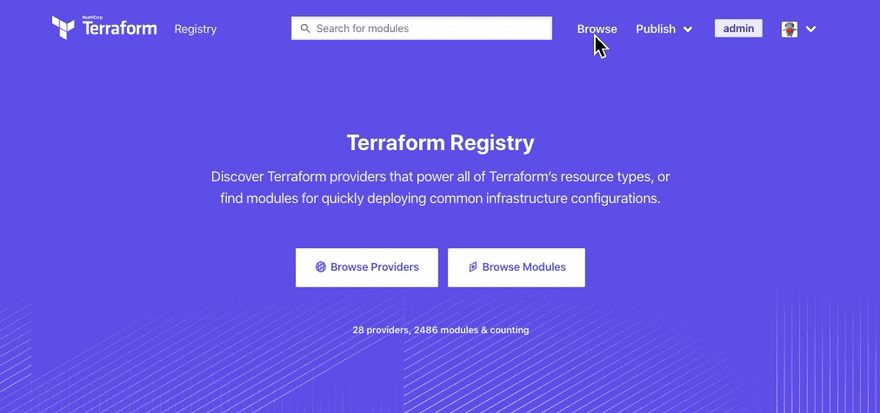

# Terraform
Use Terraform to provision infrastructure on AWS
<!-- -->
 <br>
1. [What is Terraform?](#What-is-Terraform?)
2. [Installation](#Installation)
3. [Terraform HCL](#Terraform-HCL)
4. [HCL w AWS](#HCL-w-AWS)
5. [Add a running instance in AWS](#Add-a-running-instance-in-AWS)
6. [File Uploads](#File-Uploads)

## What is Terraform?
- Terraform allows you to write infrastructure as code:
  - In other words you can either go into the web console and you can just start launching some new instances manually
  - or you can do that in code, using Terraform.
- It's the automation of your infrastructure:
  - Terraform keeps your infrastructure in certain states,
  - It keeps compliant, makes your infrastructure auditable.
  - Think about a AWS, DigitalOcean, the Azure everything that has an API.
 
 ## Installation  
  Step 1. Go to: https://www.terraform.io/ <br>
  Step 2. Download zip file for your operating system <br>
  Step 3. Install, for linux: <br>
```$ mkdir Terraform```<br>
```$ cd Terraform```<br>
```$ git clone https://github.com/wardviaene/devops-box.git``` (this will have things to install like Ansible & Terraform)<br>
```$ cd devops-box/```<br>
```$ cd scripts```<br>
```$ chmod u+x install.sh``` (add required permissions)<br>
```$ sudo ./install.sh```<br>
 Step 4. Check wether it's installed correctly:
```$ terraform version``` <br>

## Terraform HCL
HashiCorp Confiuration Language - Understanding the terraform syntax<br>
We'll create & run our first ```.tf``` easily w the following not-so-many commands:<br>
```$ mkdir terraform-test```<br>
```$ cd terraform-test```<br>
```$ vim main.tf ```<br>
```
variable "myvar"{
  type=string
  default="hello terraform"
}

variable "mymap"{
  type = map(string)
  default = {
    mykey = "my value"
  }
}

# an object is like a map but each element can have a different type
variable "myobject"{
  type = map(string)
  default = {
    firstname = "Bob"
    housenumber = 10
  }
}

# A list is always ordered, it'll always return 1,2,3 and not 3,2,1 
# despite the order of insertion
variable "mylist"{
  type = list
  default = [1,2,3]
}

# A set contains unique values, consecuently [5,1,1,2] becomes [1,2,5],
#  it doesn`t keep the order but terraform will sort it
variable "myset"{
  type = set
  default = [1,2,3]
}

# A tuple is like a list but each element can have a different type
variable "mytuple"{
  type = tuple
  default = [0,"string",false]
}

variable "mynumber"{
  type = number
  default = 3874
}

variable "myboolean"{
  type = bool
  default = true
}
```


You can let terraform infer the type omitting the type line like:
```
variable "mystring"{
  default="hello terraform"
}
```

To check variables' output run:<br>
```$ terraform console```<br>
```> var.myvar```             (output: ```"hello terraform"```)<br> 
```> var.mymap```             (output: ```tomap({"mykey" = "my value"})```)<br> 
```> var.mymap["mykey"]```    (output: ```"my value"```)<br> 
```> var.mylist```            (output: ```tolist([1,2,3,])```)<br> 
```> var.mylist[0]```         (output: ```1```)<br> 
```> element(var.mylist,0)``` (output: ```1```)<br> 
Ctrl+D

## HCL w AWS
Here we'll see how a ```.tf``` looks like with AWS as the provider & with resources as well as with variables:<br>
```$ vim resource.tf```<br> 
```
provider "aws"{

}

variable "AWS_REGION"{
  type  = string
}

variable "AMIS"{
  type = map(string)
  default = {
    eu-west-1 = "my ami" 
  }
}

resource "aws_instance" "example"{
  ami           = var.AMIS[var.AWS_REGION]
  instance_type = "t2.micro"
}
```


```$ vim terraform.tfvars```<br> 
```
AWS_REGION="eu-west-1"
```


Initialize backend & provider plugins * ```$ terraform init```<br> 
```$ terraform console```<br> 
```> var.AWS_REGION```<br> 
```> var.AMIS[var.AWS_REGION]```<br>

(\*) This should be done everytime you create a new directory

## Add a running instance in AWS
* Prerequisites:
  * Sign-on AWS: https://portal.aws.amazon.com/billing/signup?nc2=h_ct&src=header_signup&redirect_url=https%3A%2F%2Faws.amazon.com%2Fregistration-confirmation#/start/email
  * Log-in AWS: https://aws.amazon.com/ 
  * Create user with admin role: IAM > Users > Add users: with Programmatic access, Add user to group > save .csv with access key + secret key
  * Check the region you're located in
Steps:
Go to: https://cloud-images.ubuntu.com/locator/ec2/ & search eu-west-1 xenial, copy the AMI-ID of the first hvm:ebs-ssd instance type you see, for example: ami-0f29c8402f8cce65c<br>
```$ mkdir new-instance```<br> 
```$ vim instance.tf```<br>
```
provider "aws" {
  access_key = "YOUR ACCESS KEY HERE"
  secret_key = "YOUR SECRET KEY HERE"
  region     = "REGION YOU'RE LOCATED IN"
}

resource "aws_instance" "example" {
  ami           = "ami-0f29c8402f8cce65c"
  instance_type = "t2.micro"
}
```

```$ terraform init```<br> 
```$ terraform apply```<br> 
Goto AWS Console > EC2 > Instances. You'll see a new instance is running!<br> 
Now destroy it so that you don't have to pay for it: ```$ terraform destroy```<br> 
The instance will be terminated:
If you want to have a looka t your terraform file run ```$ terraform plan``` and it'll show you what terraform is planning to do.<br>
You can save the changes that terraform plans to change into the infrastructure with:<br> 
```$ terraform plan -out file```<br> 
followed by:<br> 
```$ terraform plan file```<br> 
It is a much safer way because the file contains the changes terraform plans to do into the infrastructure and therefore you'll be always sure
that the changes that you just have seen on your screen will be the change that will be applied on your infrastructure and you're not blindly applying changes.<br>
However, there's a shortcut you can use:<br> 
```$ terraform apply```<br> 
which does, simultaneously: <br> 
```$ terraform plan -out file; terraform apply file; rm file```<br> 

This can be modularized separating the code into different files:

* instance.tf
```
resource "aws_instance" "example" {
  ami           = lookup(var.AMIS, var.AWS_REGION)
  instance_type = "t2.micro"
}
```


* provider.tf
```
provider "aws"{
  access_key = var.AWS_ACCESS_KEY
  secret_key = var.AWS_SECRET_KEY
  region = var.AWS_REGION
}
```

* vars.tf
```
variable "AWS_ACCESS_KEY"{}
variable "AWS_SECRET_KEY"{}
variable "AWS_REGION"{
  default = "eu-west-1"
}

variable "AMIS"{
  type = map
  default = {
    eu-west-1 = "ami-0f29c8402f8cce65c"
  }
}
```

* terraform.tfvars(this will be included in .gitignore) for credential security
```
AWS_ACCESS_KEY=""
AWS_SECRET_KEY=""
```

After executing ```$ terraform init``` and ```$ terraform apply``` the ec2 instance will be running in AWS & 2 files will be generated into the shell: ```terraform.tfstate``` & ```terraform.tfstate.backup``` .

## File uploads

* To upload a file the provisioner ```file``` is included<br>
* To execute the script the provisioner ```remote-exec``` is included<br>
instance.tf:
```
resource "aws_key_pair" "mykey"{
  key_name = "mykey"
  public_key = file(var.PATH_TO_PUBLIC_KEY)
}

resource "aws_instance" "example" {
  ami           = lookup(var.AMIS, var.AWS_REGION)
  instance_type = "t2.micro"
  key_name = aws_key_pair.my_key.key_name
}

provisioner "file" {
  source      = "script.sh"
  destination = "/tmp/script.sh"
}

provisioner "remote-exec"{
  inline = [
    "chmod +x /tmp/script.sh",
    "sudo /tmp/script.sh"
  ]
}

connection {
    user = var.INSTANCE_USERNAME
    password = file(var.PATH_TO_PRIVATE_KEY)
}
```


* To override SSH defaults, SSH keypairs are added:
  * The public key is the one you will upload to AWS<br>
  * The private key is the one you will use to log in over SSH to this EC2 instance and upload this script.sh.<br>


vars.tf: 
```
variable "AWS_ACCESS_KEY"{}
variable "AWS_SECRET_KEY"{}
variable "AWS_REGION"{
  default = "eu-west-1"
}

variable "AMIS"{
  type = map
  default = {
    eu-west-1 = "ami-0f29c8402f8cce65c"
  }
}

variable "PATH_TO_PRIVATE_KEY"{
  default = "mykey"
}

variable "PATH_TO_PUBLIC_KEY"{
  default = "mykey.pub"
}

variable "INSTANCE_USERNAME"{
  default = "ubuntu"
}
```


Key pair can be created easily in shell: <br>
```$ ssh-keygen -f mykey```


          

